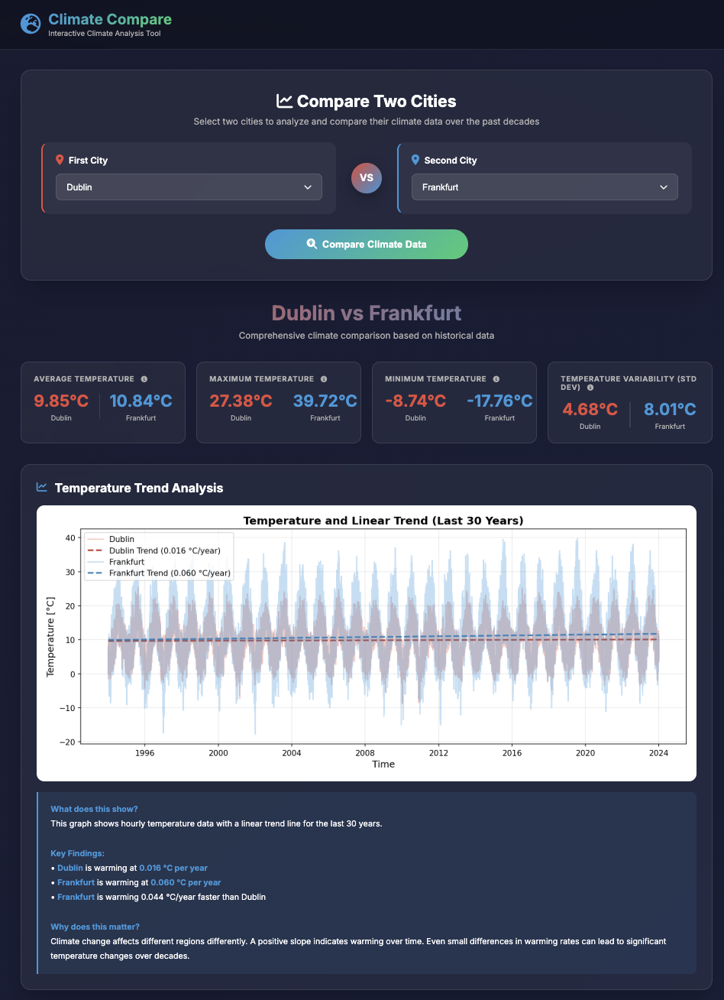
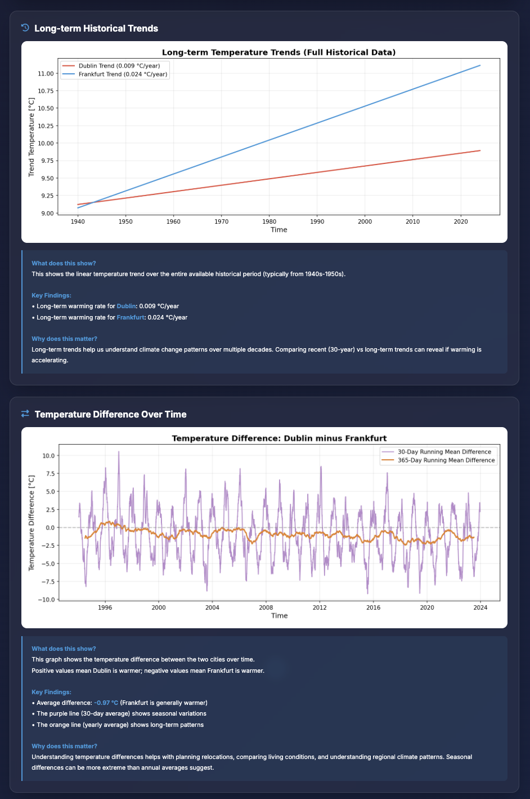
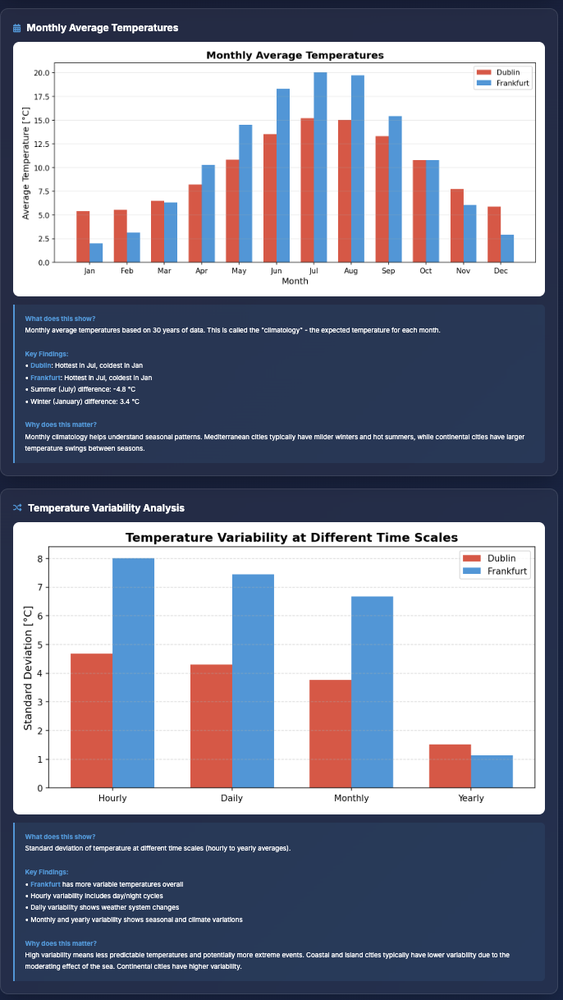
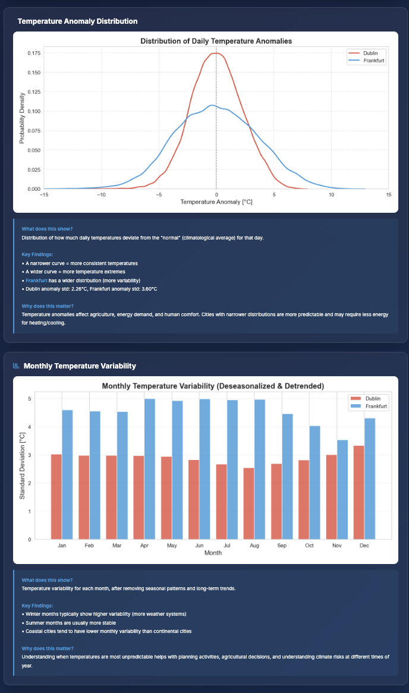
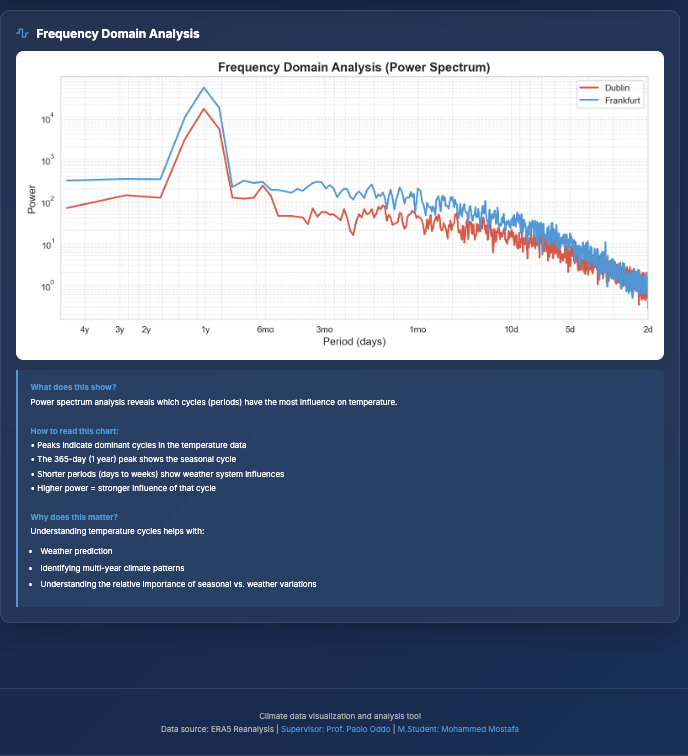

# Climate Data Visualization and Analysis Tool

### Overview

This project is a Flask-based web application for **interactive comparison of climate data between cities**.  
It loads gridded climate datasets (NetCDF `.nc` files), computes a range of statistical metrics, and renders
interactive visualizations (trends, anomalies, variability, and more) directly in the browser.

### Features

- **City comparison**: Select two cities and compare their climate using historical data.
- **30‑year climatology**: Focus on the most recent 30 years to analyse modern climate conditions.
- **Trend analysis**: Linear warming trends and long‑term temperature evolution.
- **Seasonal cycle & monthly means**: Monthly climatology plots for both cities.
- **Variability metrics**: Hourly, daily, monthly, and yearly standard deviations.
- **Anomaly distributions**: Probability distributions of temperature anomalies.
- **Frequency analysis**: Power spectrum of temperature time series (dominant periods and cycles).

### Tech Stack

- **Backend**: Python, Flask
- **Data & analysis**: xarray, NumPy, pandas, SciPy, xarray, SciPy signal processing
- **Visualization**: Matplotlib, Seaborn (rendered server-side to PNG, sent as base64 to the frontend)
- **Frontend**: HTML/CSS/JS templates (see `templates/index.html`)

### Project Structure (key files)

- `app.py` – main Flask application, routes, and all analysis/plotting functions.
- `wsgi.py` – optional entrypoint if you deploy with a WSGI server (e.g. gunicorn).
- `templates/index.html` – main UI for selecting cities and displaying results.
- `content/` – folder containing climate data files for each city (`<city_name>.nc`).
- `screens/` – screenshots of the UI for quick preview.
- `requirements.txt` – Python dependencies.
- `.gitignore` – Git ignore rules for the repo.

### Requirements

- Python 3.9+ (3.12 recommended)
- `pip` or `pipenv`/`poetry` for installing dependencies

Install dependencies (with NumPy pinned below 2 to avoid binary-compat issues):

```bash
python -m venv .venv
source .venv/bin/activate  # macOS / Linux
pip install -r requirements.txt
```

### Data Preparation

1. Create a folder named `content/` in the project root if it does not already exist.
2. Place one NetCDF file per city in this folder, with filenames of the form:

   - `content/<city_name>.nc`

3. Each file should at least contain:

   - A `time` dimension
   - A `t2m` variable (2‑meter air temperature) in Kelvin

The application will automatically list all available cities by scanning `content/` for `.nc` files.

### Running the Application Locally

From the project root:

```bash
export FLASK_APP=app.py
export FLASK_ENV=development  # optional
flask run
```

Or, depending on how you prefer to run Flask apps and how `app.py` is structured, you can often run:

```bash
python app.py
```

Then open `http://127.0.0.1:5000/` in your browser and select two cities to compare.

### Screenshots

If you just want a quick look at what the app does before running it, here are the screenshots:

#### Home / city selection



#### Basic stats + trend comparison



#### Monthly climatology / seasonality



#### Variability + anomaly analysis



#### Frequency-domain / power spectrum



### Development Notes

- Plots are generated server‑side using Matplotlib/Seaborn and encoded as base64 images for the frontend.
- Most analysis logic lives in helper functions in `app.py` (trend, variability, anomaly, and frequency analysis).
- When adding new metrics or visualizations, follow the existing pattern:
  1. Implement a helper function in `app.py` that returns data + optional base64 image.
  2. Call it from the `/compare` route and include results in the JSON payload.
  3. Update `templates/index.html` to render the new section.

### License

This project is licensed under the MIT License - see the LICENSE file for details.

